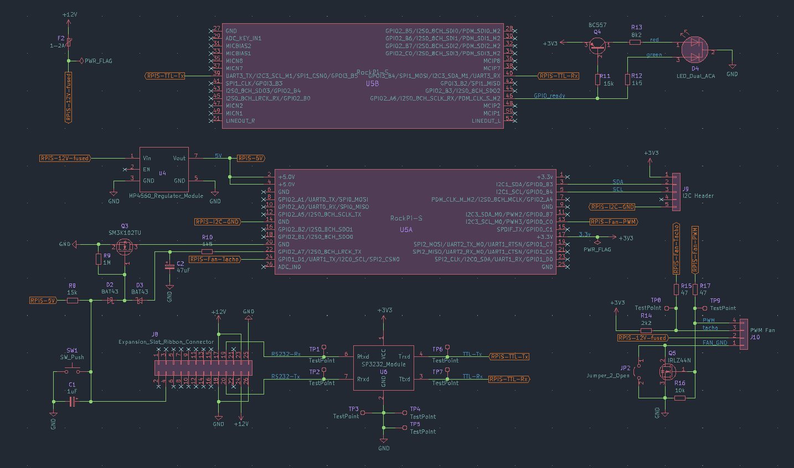
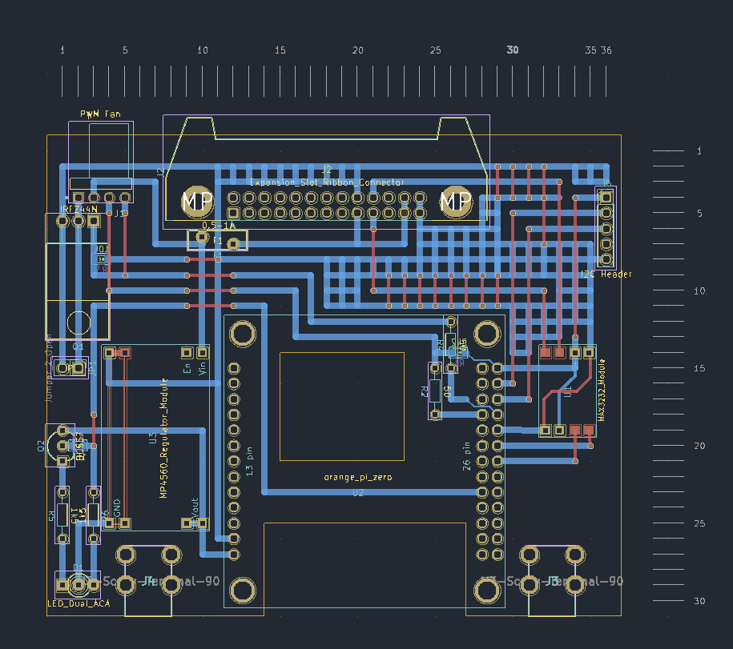
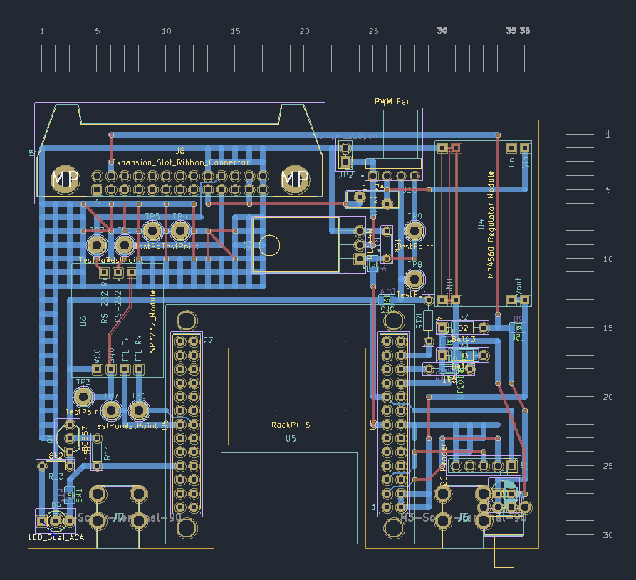
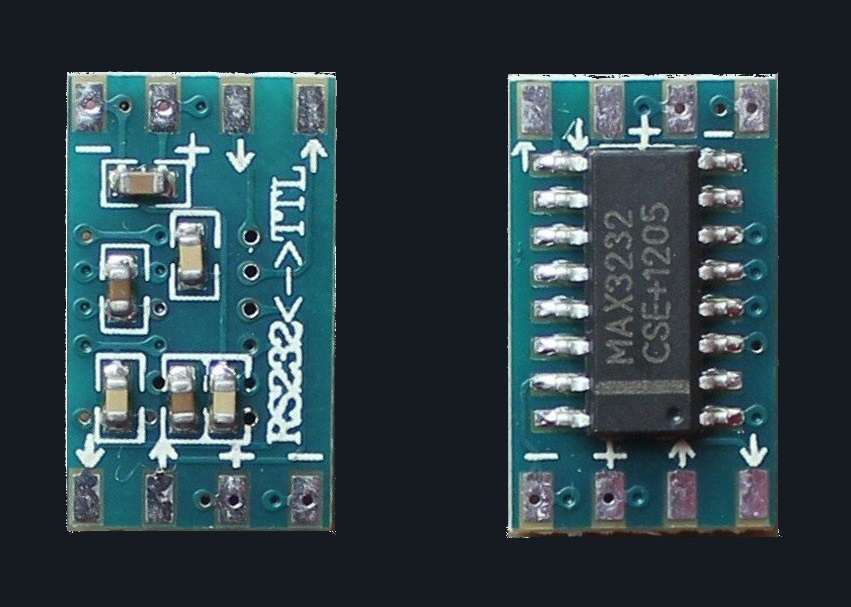

# Opti-UPS Expansion Slot Single Board Computer


KiCad files for circuits built on prototyping board that will fit in a UPS
expansion slot, to add an ethernet interface for network UPS management.

-   [Rationale](#rationale)
-   [Single Board Computers](#single-board-computers)
-   [Expansion Boards](#expansion-boards)
    -   [Assembled](#assembled)
    -   [Schematics](#schematics)
    -   [Layouts](#layouts)
    -   [Components](#components)
        -   [Pre-built Modules](#pre-built-modules)
        -   [Mounting](#mounting)
    -   [Status LED](#status-led)
        -   [/etc/systemd/system/ready-led.service](#etcsystemdsystemready-ledservice)
    -   [I²C Header](#ic-header)
        -   [Real-time clock](#real-time-clock)
-   [Opti-UPS PS1440RM](#opti-ups-ps1440rm)
    -   [Expansion Slot](#expansion-slot)
    -   [Pinouts](#pinouts)
-   [Software](#software)
    -   [NUT](#nut)
        -   [Minimal configuration](#minimal-configuration)
    -   [Windows 2000 in Docker](#windows-2000-in-docker)
        -   [/etc/docker/daemon.json](#etcdockerdaemonjson)
        -   [Dockerfile](#dockerfile)
        -   [docker-compose.yml](#docker-composeyml)
-   [Links](#links)
    -   [Datasheets](#datasheets)

These are designed with an Opti-UPS PS1440RM in mind, but should work in other
UPS expansion slots after adjusting for the pinout of the expansion slot
connection.

There's two different boards, for two different SBCs: an
[Orange Pi Zero](http://www.orangepi.org/orangepiwiki/index.php/Orange_Pi_Zero)
and a [Rock Pi S](https://wiki.radxa.com/RockpiS).

## Rationale
My UPS is 20 years old but still works fine. Except, the official Opti-UPS
software for the UPS won't run in anything newer than Windows 2000 and I don't
want to run a VM just to talk to the UPS.

Also, it's nice to have ethernet coming right out of the UPS, rather than a
serial cable.

Proper expansion cards for the UPS aren't easy to find, due to its age, so
making something to fit seems sensible.

## Single Board Computers
The two SBCs offer different solutions to the problem. The Orange Pi Zero is
cheap and will happily run [Network UPS Tool (NUT)](https://networkupstools.org/).
The Rock Pi S is also relatively cheap, but _should_ be able to run [Windows 2000
in Docker](https://github.com/hectorm/docker-qemu-win2000), allowing the official
Opti-UPS software to run.

The Rock Pi S will want to draw more power than the Orange Pi Zero, and it's
overkill for just running NUT (which it will also happily do), but it is more
capable thus provides more flexibility.

These boards will work directly with other SBCs that have the same pin
arrangement (e.g. Orange Pi Zero 2 and Orange Pi Zero 3), although the spaces
in the boards to fit RJ-45/USB sockets and any CPU heatsinks may need to be
adjusted.

It's not too difficult to customize these boards for other SBCs with different
pin arrangements.

## Expansion Boards
Both boards are fundamentally the same. The only differences are the physical
layout of headers on the SBC they connect to, and the function of each header
pin. It's just a matter of routing tracks appropriately.

The UPS is connected to _UART2_ (_/dev/ttyS2_) in either case.

### Assembled
<p><a href="images/assembled-RockPiS-top.jpg">
  
</a><br/>
<em>Rock Pi S board (top)</em></p>

<p><a href="images/assembled-RockPiS-side.jpg">
  
</a><br/>
<em>Rock Pi S board (side)</em></p>

### Schematics
<p><a href="images/schematic-OrangePiZero.png">
  
</a><br/>
<em>Orange Pi Zero schematic</em></p>

<p><a href="images/schematic-RockPiS.png">
  
</a><br/>
<em>Rock Pi S schematic</em></p>

### Layouts
<p><a href="images/layout-OrangePiZero.png">
  
</a><br/>
<em>Orange Pi Zero layout</em></p>

<p><a href="images/layout-RockPiS.png">
  
</a><br/>
<em>Rock Pi S layout</em></p>

> [!NOTE]
> The scales around the boards are indicating the number of holes in the PCB,
> with a 2.54mm pitch. Thus each increment is equal to 2.54mm.

Given these are designed to be built on prototype board, the tracks all tend to
run in long strips. In most cases, blue tracks should be copper on the bottom of
the PCB and red tracks should be wires on top of the PCB. This means we should
only need to use a single-sided PCB.

The modules both have multiple common ground pins, and the MAX3232 module has
multiple common supply pins as well. The tracks in the layout under/over these
modules connecting these common pins are pre-existing in the module and don't
need to be created on the board.

### Components
#### Pre-built Modules
The power supply and RS-232<->TTL converters on these boards are pre-built
modules, soldered directly to the main board. Suitable modules are cheap on
eBay/AliExpress or from other sources, and they make routing conductors on
prototype board a lot simpler.

There should be room to fit modules of different dimensions than those I've used
without needing to move anything but some conductors. If desired, extending
the length of the board provides ample room to build these modules from scratch
on the board itself.

##### Switching Power Supply - MP4560
<p><a href="images/module-MP4560.jpg">
  
</a><br/>
<em>MP4560 module</em></p>

We'll be sourcing 12V DC from the UPS expansion slot's connector and regulating
down to 5V for the SBC. An efficient switching supply makes a lot more sense
than a linear regulator, both in terms of heat generation and the current we'll
want to pull through a 28AWG ribbon cable.

The MP4560 seems a good choice because the high switching frequency means the
inductor can be physically smaller than slower options (e.g. LM2596), so there's
not going to be any issue with clearance for a toroid inside the expansion slot.
High switching frequencies should result in less ripple in the output as well.

The module performs well in a load test and shouldn't have any problems meeting
the power demands of the SBCs.
<p><a href="images/module-MP4560-load-test.bmp">
  
</a><br/>
<em>MP4560 module load test</em></p>

##### RS-232 <-> TTL Converter - MAX3232
<p><a href="images/module-MAX3232.jpg">
  
</a><br/>
<em>MAX3232 module</em></p>

The UPS is providing real zero-crossing RS-232, which doesn't do an SBC GPIO any
good, so we need to convert this to the 0-3.3V TTL level the SBC expects. The
MAX3232 seems a good option to do this.

This module sources its 3.3V supply from the SBC's GPIO, so we don't need
another standalone switching supply.

#### Mounting
Right-angled M3 screw terminals are used for mounting the board on the blanking
panel that covers the expansion bay, after cutting appropriate holes for the
RJ-45 socket (and probably the USB port).

<p><a href="images/board-mounting-terminal.jpg">
  
</a><br/>
<em>Right-angle M3 screw terminal</em></p>

### Status LED
The status LED will be red when the SBC is powered but can be changed to green
via the GPIO. Switching this LED to green when relevant software is loaded
means we have an indication for both 'powered' and 'ready'.

The trimpots are for brightness adjustment, giving a current range of roughly
2 to 15mA. They can be omitted in favour of fixed resistors.

To control the green LED, the Orange Pi Zero board uses PA19 (chip 0, offset 19)
and the Rock Pi S boards uses GPIO2_B5 (chip 2, offset 13).

If using NUT, the simplest method of control is to create a systemd unit file
for the LED which starts and stops with the _nut-server_ service. For example,
on the Rock Pi S (note the arguments to _gpioset_ in ExecStart/ExecStop):

#### /etc/systemd/system/ready-led.service
```ini
[Unit]
Description='ready' status indicator LED
After=nut-server.service nut-driver.target
Requires=nut-server.service nut-driver.target
PartOf=nut.target

[Service]
Type=oneshot
ExecStart=gpioset 2 13=1
ExecStop=gpioset 2 13=0
RemainAfterExit=yes

[Install]
WantedBy=nut.target
```

To enable the service:
```sh
sudo systemctl daemon-reload
sudo systemctl enable ready-led
```

Things are a bit more complicated if running Windows 2000 (or NUT) in Docker,
which isn't yet documented here.

### I²C Header
An I²C connection is made available through jumper pins. This can be used for
any I²C device, but a UPS could be a good place for a real time clock and NTP
server.

#### Real-time clock
There are many options available, but the easiest is to buy a cheap pre-built
module. The pin header has an appropriate layout for some modules to plug
directly in. For example:

<p><a href="images/module-DS3231.jpg">
  
</a><br/>
<em>DS3231 RTC module</em></p>

#### Charging Pin
The horizontal jumper enables charging of a battery or capacitor via a pin that
is otherwise unused in many directly pluggable RTC modules. This is useful if
we want to modify an RTC module by replacing a non-rechargable battery, only
needing to run a passive wire connection between the pin and the battery or
capacitor on the module itself.

Charging should not be enabled if the RTC module has a non-rechargable battery
or if it has pre-existing charging circuity.

The 20ohm resistor limits charging current to 165mA, so we stay below the SBC's
200mA maximum on the 3.3V output.

## Opti-UPS PS1440RM
### Expansion Slot
The expansion slot has a PCB edge connector in it, connected to a 2x13 pin
socket on the UPS main board via a ribbon cable.

Instead of making a board precise enough to fit into this edge connector, it's
simpler to swap the ribbon cable for one with 2x13 pin connectors on each end,
feed one end through the hole in the expansion slot housing that held the
edge connector, and connect directly to the board.

### Pinouts
The DB9 connector on the UPS is not wired for standard RS-232:
<p><a href="images/Opti-UPS-DB9-connector.png">
  
</a><br/>
<em>Opti-UPS PS1440RM DB9 connector pinout</em></p>

The cable that comes with the UPS switches wires around so that the other end
of it is wired in the standard way for RS-232. There appear to be diodes present
as well.

Some of the pins in the expansion slot connector are common with those in the
DB9 connector, so we have an easy way to find the data pins in the expansion
slot.

Probing the 2x13 header with a multimeter and component tester (via a long
ribbon cable, so as not to work inside a live UPS) makes the 12V DC supply pins
apparent.

<p><a href="images/schematic-cable.png">
  
</a><br/>
<em>PS1440RM cable and header pinouts</em></p>

## Software
### NUT
It may be necessary to manually add the _nut_ user to the _dialout_ and/or _tty_
groups, so it has permissions for the serial device:

```sh
sudo usermod -a -G dialout nut
sudo usermod -a -G tty nut
```

#### Minimal configuration

##### /etc/nut/ups.conf
```ini
# Sometimes noise in the RS-232 signal can prevent getting a useful response to
# a command which, for some commands during init, can cause nut-driver to fail
# to start. Increasing the number of retries significantly decreases the chances
# of this being a problem.
maxretry=30

[ps1440rm]
        driver = optiups
        port = /dev/ttyS2
        desc = "Opti-UPS PS-1440RM"
```

##### /etc/nut/upsd.conf
```sh
# listen to all IPv4
LISTEN 0.0.0.0 3493

# listen to all IPv6
LISTEN :: 3493
```

##### /etc/systemd/system/nut-server.service.d/override.conf
```ini
[Unit]
# Sometimes nut-server can fail to start at boot due to the network not being up
Wants=nut-driver.target network-online.target
Requires=network.target network-online.target
```

### Windows 2000 in Docker
> [!NOTE]
> This is still a work in progress and is not complete. The official software
> doesn't necessarily offer any advantage over running NUT and this may be a waste
> of time and effort.
>
> The Docker container runs okay, but is somewhat sluggish. The Opti-UPS software
> installs and runs. However, as it stands at the moment, the COM port isn't
> functioning inside Windows 2000. This presents as a driver issue, but I assume
> the root cause is me misunderstanding the QEMU configuration,.

We can start with the [hectorm/qemu-win2000](https://hub.docker.com/r/hectorm/qemu-win2000)
Docker image and install the official Opti-UPS software to monitor things.

This will require an SD card installed into the Rock Pi S, as there's not enough
room on the 4GB eMMC for the OS and the image. To move the Docker data files to
the SD card (after it has been formatted and mounted):

#### /etc/docker/daemon.json
```json
{
        "data-root": "/mnt/sdcard/docker/"
}
```

The image requires _qemu-kvm_:
```sh
sudo apt-get install --no-install-recommends qemu-kvm
```

#### Dockerfile
It looks like we need to modify the image to tell QEMU the serial port exists.
We're using UART2 which will be _/dev/ttyS2_ in Armbian and made available as
the same in the Docker container.

QEMU, running inside the container, can be pointed in the right direction as
such:
```Dockerfile
FROM "hectorm/qemu-win2000:latest-arm64v8"

ENV VM_SERIAL_DEVICE="ttyS2"

RUN awk '!f && sub(/if/, "set -- \"$@\" -chardev serial,path=\"/dev/${VM_SERIAL_DEVICE:-ttyS2}\",id=hostserial\nset -- \"$@\" -device pci-serial,chardev=hostserial\n\nif"){f=1} 1' \
        /etc/runit/runsvdir/default/qemu/run > ./run.temp \
  && cat ./run.temp > /etc/runit/runsvdir/default/qemu/run \
  && rm -f ./run.temp
```

Build with: `docker build -t moonbuggy2000/qemu-win2000-opti-ups:latest-arm64v8 .`

> [!WARNING]
> This doesn't work. The port appears but Windows 2000 doesn't find suitable
> drivers for it. Using `isa-serial` instead of `pci-serial` leads to the driver
> installing automatically and apparently without complaint, but it doesn't seem
> to be getting data from the UPS in that case either.

#### docker-compose.yml
We don't have a huge amount of RAM to play with, and things slow to a crawl if
we're heavily using the zram, so we'll need to limit the RAM the container can
use.

```yaml
version: '3.9'

services:
  opti-ups:
    image: moonbuggy2000/qemu-win2000-opti-ups:latest-arm64v8
    container_name: opti-ups
    hostname: opti-ups
    restart: unless-stopped
    ports:
      - 3389:3389/tcp
      - 5900:5900/tcp
      - 6080:6080/tcp
    devices:
      - "/dev/kvm:/dev/kvm"
      - "/dev/ttyS2:/dev/ttyS2"
    environment:
      - "VM_CPU=3"
      - "VM_KVM=1"
      - "VM_RAM=128M"
      - "VM_SERIAL_DEVICE=ttyS2"
    volumes:
      - "opti-ups:/mnt"
    network_mode: bridge

volumes:
  opti-ups:
    driver: local
    name: opti-ups
```

## Links
### Datasheets
*   [DS3231](https://www.analog.com/media/en/technical-documentation/data-sheets/DS3231.pdf)
*   [MAX3232](https://www.analog.com/media/en/technical-documentation/data-sheets/MAX3222-MAX3241.pdf)
*   [MP4560](https://www.monolithicpower.com/en/documentview/productdocument/index/version/2/document_type/Datasheet/lang/en/sku/MP4560/document_id/305)
